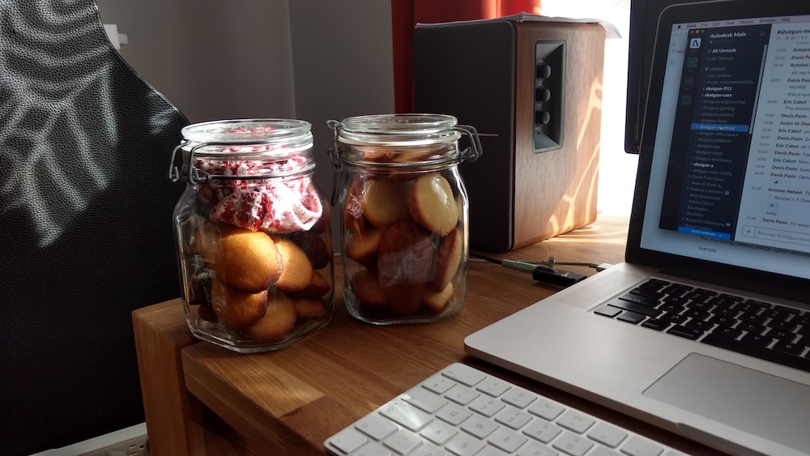

## Description

Cette recette me fut transmise par ma mère et je l'ai déjà réalisé de nombreuses fois.
La petite touche de fleur d'oranger permet de trancher avec le moelleux de la madeleine.

**Important**: Bien respecter les températures de cuisson.

## Recette

#### Ingrédients (pour 20 madeleines)

- 3 œufs
- 120g de sucre
- 150g de farine
- 5g de levure chimique (ou de poudre à pate)
- 20g de miel liquide (se remplace sans problèmes par du sirop d'érable)
- 125g de beurre
- 1/2 cuillère a café d'eau de fleur d'oranger

#### Instructions

##### La pate

1. Faire fondre le beurre au micro-onde (pas le temps de niaiser).
2. Battez, œufs, sucre, miel et vanille fermement jusqu'à blanchissement du mélange.
3. Incorporez farine et levure
4. Versez le beurre fondu et mélangez.
5. Couvrez et placez au frais idéalement 4h au pire 30min-1h.

##### La cuisson

1. Préchauffez le four a 230°C
2. Mettre une bonne cuillère de pate par alvéole du moule à madeleine (si vous n'avez pas de moule a madeleine… il est temps de faire des sablés ou d'aller en acheter un et laisser reposer la pate plus longtemps)
3. Enfournez et baissez la température du four a 200°C.
4. Après 5 minutes de cuisson (dans un four a convection; je pense que 3 suffisent dans un four a chaleur tournante) baissez le four à 180°C et laissez cuire pendant 7 minutes (5 si chaleur tournante).
5. Sortir les madeleines et les démouler aussitôt (sur une grille, une assiette, ou n'importe quoi d'assez froid).
6. Repeat — Serieusement qui ne mange qu'une seule fournée de madeleine ?

## Photos

###### Enfermées dans des pots :)

###### La recette "originale" de ma maman.

