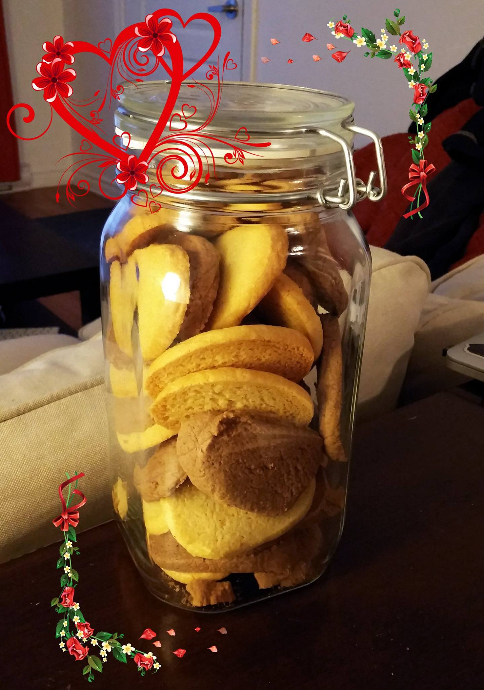

## Description

Des sablés facile à faire pour les gens pressés.

## Recette

#### Ingrédients (pour 30 sablés)

- 200g de farine
- 100g de beurre (demi-sel bien sur)
- 100g de sucre ou de cassonade
- 1 œuf
- 1 cuillère a café de cannelle (ou du cacao ou rien :D)

#### Instructions

1. Préchauffer le four à 180°C.
2. Battre l'oeuf avec le sucre et la cannelle.
3. Ajoutez ensuite la farine et sablez la pâte avec les doigts
4. Incorporez le beurre.
5. Malaxez la pâte avec les mains.
6. Applatir la pate a même la plaque (ou sur du papier parchemin).
7. Si vous êtes fancy, avec de petits emporte pièces découpez la pâte. Sinon faites des petites boules.
8. Laissez cuire environ 15 min (le tour des sablés doit être doré).

## Photos

###### Sablés (Niais)

###### Sortie du four

